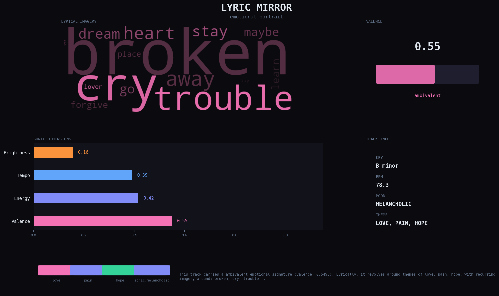

<div align="center">

# Lyric Mirror

**The emotional DNA of any song, visualized.**

[](https://python.org)
[](https://github.com/openai/whisper)
[](https://gradio.app)
[](LICENSE)

<br/>



<br/>

_Upload a song. Get an emotional portrait of its artist._

</div>

---

## What is Lyric Mirror?

Most music apps tell you the genre. Lyric Mirror tells you the **feeling**.

It runs three parallel pipelines on any audio file and merges them into a single emotional portrait — a dark-themed visualization showing how a track feels both lyrically and sonically.

```
Audio File
  │
  ├── Whisper ──────► lyrics transcript
  │                        │
  │                   spaCy NLP
  │                        │
  │              keywords · themes · sentiment
  │                        │
  └── librosa ──────► tempo · energy · key · valence
                           │
                    merge signals
                           │
                  emotional portrait (PNG)
```

---

## Features

| Feature                | Description                                            |
| ---------------------- | ------------------------------------------------------ |
| **Speech-to-text**     | OpenAI Whisper — works in any language                 |
| **Theme detection**    | love · pain · hope · anger · nostalgia · joy           |
| **Sentiment analysis** | Lexicon-based, no heavy model download                 |
| **Acoustic analysis**  | Tempo, energy, key, mode, valence via librosa          |
| **Visual portrait**    | Dark-themed PNG with word cloud + audio dimensions     |
| **Web UI**             | Clean Gradio interface, runs locally or on HuggingFace |

---

## Quick Start

**1. Clone and install**

```bash
git clone https://github.com/YOUR_USERNAME/lyric-mirror
cd lyric-mirror

python -m venv venv
source venv/bin/activate       # Windows: venv\Scripts\activate

pip install -r requirements.txt
python -m spacy download en_core_web_sm
```

**2. Run**

```bash
python app.py
```

Open `http://127.0.0.1:7860` in your browser, upload any mp3 or wav file, and click **Analyze**.

---

## Tech Stack

<table>
  <tr>
    <td align="center"><b>Speech</b></td>
    <td align="center"><b>NLP</b></td>
    <td align="center"><b>Audio</b></td>
    <td align="center"><b>UI</b></td>
    <td align="center"><b>Viz</b></td>
  </tr>
  <tr>
    <td align="center">OpenAI Whisper</td>
    <td align="center">spaCy</td>
    <td align="center">librosa</td>
    <td align="center">Gradio</td>
    <td align="center">matplotlib</td>
  </tr>
</table>

---

## Example Output

Given the track **"Cut" by Ali Sorena**, Lyric Mirror outputs:

```json
{
  "combined_valence": 0.33,
  "primary_theme": "love",
  "audio": {
    "tempo_bpm": 76.0,
    "dominant_key": "D#",
    "mode": "minor",
    "sonic_mood": "melancholic"
  },
  "summary": "This track carries a negative emotional signature. Lyrically,
              it revolves around themes of love, with recurring imagery around
              bring, moment, maybe, travel, world. Sonically it feels
              melancholic, sitting at 76.0 BPM in D# minor."
}
```

---

## Roadmap

- [x] Audio transcription with Whisper
- [x] NLP theme and sentiment analysis
- [x] Acoustic feature extraction
- [x] Visual emotional portrait
- [x] Gradio web UI
- [ ] Compare two songs side by side
- [ ] Playlist generation from shared emotional signature
- [ ] Multi-language NLP support
- [ ] DALL-E portrait art generation

---

## License

MIT — feel free to use, modify, and build on top of this project.

---

<div align="center">
  <sub>Built with Python · OpenAI Whisper · spaCy · librosa · Gradio</sub>
</div>
